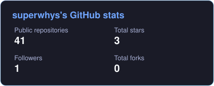
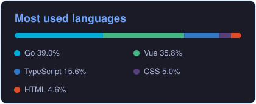

<div align="center">


### Developer · Open-source enthusiast · Lifelong learner

I enjoy turning ideas into reliable software with **Go**, **Python**, and cloud-native technologies.

<p>
  <a href="https://github.com/superwhys?tab=followers"></a>
  
</p>

</div>

## About me

```go
package main

var superwhys = struct {
	Focus    []string
	Learning string
	Motto    string
}{
	Focus:    []string{"Backend", "Cloud Native", "Open Source"},
	Learning: "Something new every day",
	Motto:    "It'll help the luck stick 🍀",
}
```

## Tech stack

<div align="center">

**Languages & Frameworks**


**Web**


**Data, Messaging & AI**


<br />


**Cloud & Tooling**


</div>

## GitHub stats

<div align="center">
  <a href="https://github.com/superwhys">
    
  </a>
  <a href="https://github.com/superwhys?tab=repositories">
    
  </a>
</div>

<div align="center">
  
</div>

<div align="center">

### Thanks for stopping by ✨

<sub>Explore, create, and leave things a little better than you found them.</sub>


</div>
